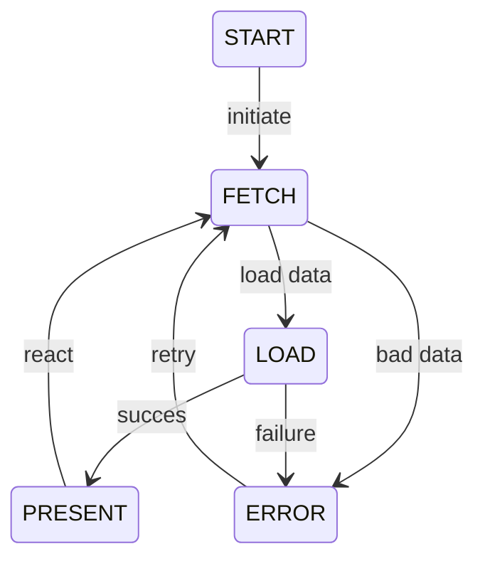

# Server Driven UI (SDUI)

## Intentions

Make a Server Driven UI module for SwiftUI applications that has a direct use. That way the application maintainer would only be concerned with the components and templates of the application.
Since SwiftUI differs from UIKit making it easier to write code for screens, this module would not be directed for that use solely. But, directed for a screen with unusual changes of UI, end-client personalized UI, or any other type of UI that need to be controlled by the backend.

## Basic Architecture

### State Machine

State machine to control the states for fetching, loading and presenting a screen. It also has auxiliaries states for error cases and the initial state. Follow its drawing:



### Decoding

The JSON object that is received has the following format:

```json
{
    "screenName": "<screen-name>",
    "templates": [
        {
            "id": "<template-id>",
            "type": "<template-type>",
            "order": 1,
            "componentsId": [
                {
                    "id": "<component-id>",
                    "order": 1
                },
                {
                    "...": "..."
                }
            ]
        },
        {
            "...": "..."
        }
    ],
    "components": [
        {
            "id": "<component-id>",
            "type": "<component-type>",
            "bodyId": "<body-id>"
        },
        {
            "...": "..."
        }
    ],
    "body": [
        {
            "id": "<body-id>",
            "body": {
                "<body-key>": "<body-key-value>",
                "...": "..." 
            }
        },
        {
            "...": "..."
        }
    ]
}
```

And is decoded into the following swift object:

```swift
ScreenModel(
    screenName: "<screen-name>",
    templates: [
        SDUI.TemplateModel(
            id: "<template-id>",
            type: SDUI.TemplateType(rawValue: "<template-type>"),
            components: [
                SDUI.ComponentModel(
                    id: "<component-id>",
                    type: SDUI.ComponentType(rawValue: "<component-type>"),
                    body: SDUI.BodyModel(
                        id: "<body-id>",
                        data: [
                            "<body-key>": "<body-key-value>",
                            ...
                        ]
                    )
                ),
                ...
            ]
        ),
        ...
    ]
) 
```
